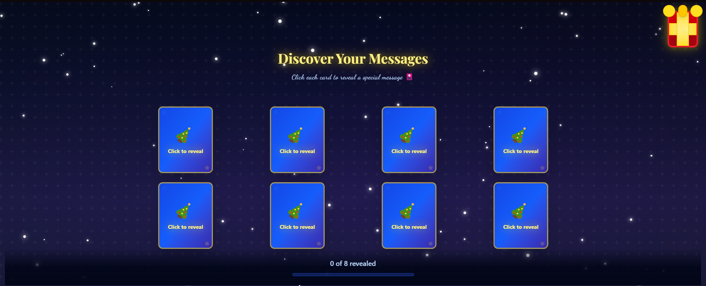
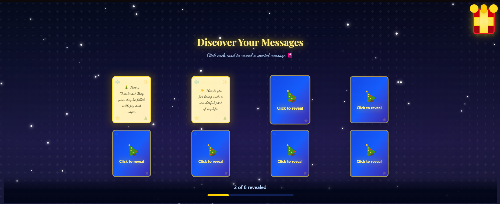

# 🎄 Christmas Gift Experience

An interactive Christmas gift web app. Click the gift box to reveal personalized messages on flip cards with animations, snowfall, and ambient music.

---

## 📸 Screenshots

### Landing Page - Gift Box


### Cards Grid - Click to Flip


### Flipped Card - Reveal Message


### Completion Screen - Celebration


---

## ✨ Features

- 🎁 Interactive animated gift box
- 🃏 3D flip card animations with messages
- ❄️ Continuous snowfall & twinkling stars
- 🎵 Auto-playing ambient music with toggle
- 📱 Mobile-first responsive design
- ♿ Accessible (keyboard nav, ARIA labels)

---

## 🚀 Quick Start

```bash
# Clone & install
git clone https://github.com/MRoland0822/christmas-gift-app.git
cd christmas-gift-app
npm install

# Run locally
npm run dev
# Open http://localhost:3000
```

---

## 🛠️ Tech Stack

- **Next.js 14** - React framework
- **TypeScript** - Type safety
- **Tailwind CSS** - Styling
- **Framer Motion** - Animations

---

## 📁 Project Structure

```
app/
├── page.tsx                 # Main page
├── layout.tsx               # Global layout
├── globals.css              # Global styles
└── components/
    ├── GiftBox.tsx          # SVG gift
    ├── CardGrid.tsx         # Card grid
    ├── Card.tsx             # Flip card
    ├── FinalMessage.tsx     # Completion
    ├── Snowfall.tsx         # Snow animation
    ├── MusicToggle.tsx      # Audio control
    └── TwinklingStars.tsx   # Background stars
public/
└── audio/
    └── Happy Christmas Background Music For Videos.mp3
```

---

## 🎮 How to Use

1. Click the gift box to open
2. Click cards to flip and reveal messages
3. Flip all cards to see the completion screen
4. Toggle music with the button (top-right)
5. Click "Open Again" to restart

---

## 🎨 Customize

### Change Messages
Edit `app/page.tsx`:
```typescript
const MESSAGES = [
  '🎄 Your message here!',
  '✨ Another message',
];
```

### Change Colors
Edit `app/globals.css`:
```css
:root {
  --primary-gold: #ffd700;
  --primary-blue: #a8d8ff;
}
```

### Snowfall Intensity
In `app/page.tsx`:
```typescript
<Snowfall intensity="light" />  // 'light' | 'medium' | 'heavy'
```

---

## 🚀 Deploy to Vercel

1. Push to GitHub
2. Go to [vercel.com](https://vercel.com)
3. Import your GitHub repo
4. Click "Deploy"

Done! Every push automatically redeploys.
